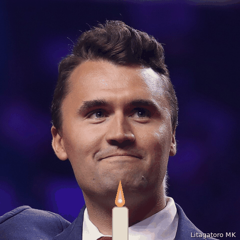
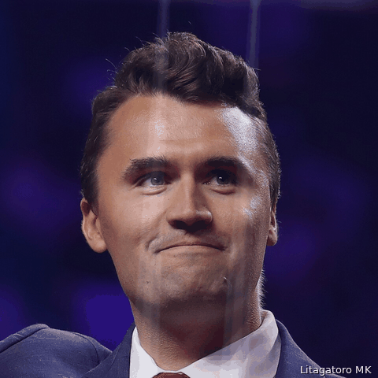
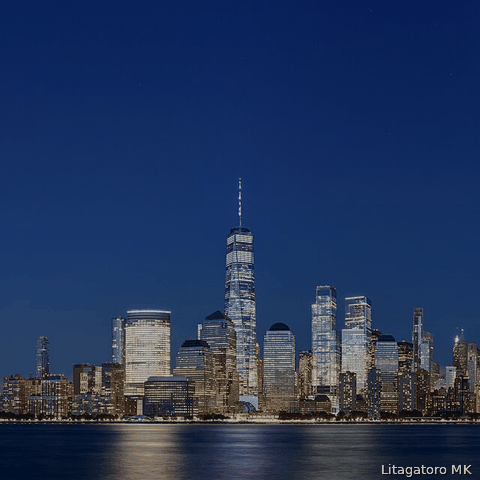
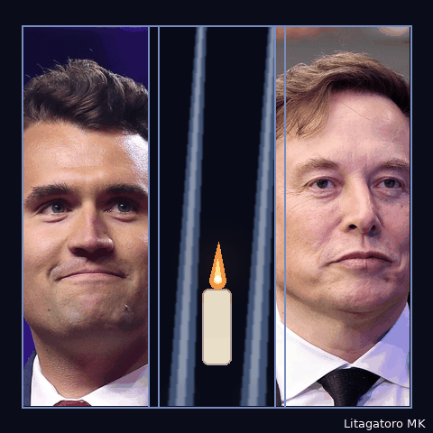
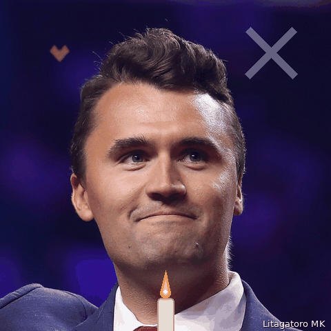

# XLOVESCHARLIE — Icon Samples (Review)

Review samples for the **XLOVESCHARLIE** tribute token launch ("X remembers") on the PONS
launchpad. The launch marks the Charlie Kirk 1-year memorial and the 9/11 25th anniversary,
with the X / Elon Musk tribute narrative. All imagery is memorial-toned: portraits,
candlelight, Tribute-in-Light beams, and the Manhattan skyline.

Each icon is a 480×480 looping animated GIF (~5–7 frames, ~0.6–0.95 s/frame, <1 MB).
The first frame of each GIF is its strongest single image so it works as the static
icon in list views. Every frame carries a discreet `Litagatoro MK` review watermark.

## Variants

### 1. Candle Vigil — `icon-v1-candle-vigil.gif`


Kirk portrait with a flickering foreground candle → Tribute-in-Light beams + candle → Elon frame → "X remembers".

### 2. Twin Beams — `icon-v2-twin-beams.gif`


Constant twin light-beam backdrop while the foreground crossfades: Kirk → candle → Elon → "X remembers".

### 3. Skyline Memorial — `icon-v3-skyline-memorial.gif`


Lower Manhattan at dusk; the tribute beams slowly brighten, Kirk's portrait fades in over the skyline, ends on "X remembers".

### 4. Triptych — `icon-v4-triptych.gif`


Three panels (Kirk | beams + candle | Elon) assemble piece by piece, hold with a brighter glow, then the "X remembers" text frame.

### 5. Minimal Heart — `icon-v5-minimal-heart.gif`


Least motion, cleanest: Kirk portrait + subtle X motif + small heart of light + gentle candle flicker, with a brief beams flash mid-loop.

## Sources & licenses

Photos from Wikimedia Commons (see `assets/`):

- `kirk.jpg` — Charlie Kirk headshot, [CC BY-SA 2.0](https://commons.wikimedia.org/wiki/File:Charlie_Kirk_(53952923573)_(headshot_cropped).jpg)
- `elon.jpg` — Elon Musk portrait, [CC BY-SA 4.0](https://commons.wikimedia.org/wiki/File:Elon_Musk_-_54820081119_(cropped).jpg)
- `beams.jpg` — Tribute in Light (2010), [public domain](https://commons.wikimedia.org/wiki/File:Tribute_in_Light_in_2010.jpg)
- `skyline.jpg` — Lower Manhattan with Tribute in Light, [CC BY-SA 4.0](https://commons.wikimedia.org/wiki/File:Lower_Manhattan_from_Jersey_City_September_2020_HDR_panorama.jpg)

Candle flames, supplemental beams, the X motif, hearts, and text frames are drawn
programmatically (no AI image generation, no gag/meme content).

## Rebuild

```
python3 -m pip install pillow
python3 build_icons.py
```
